# 👋 Olá, eu sou Victor Ulrich

### Desenvolvedor Full Stack | React • TypeScript • Java • Spring Boot

🎓 Análise e Desenvolvimento de Sistemas — **FIAP**  
💼 Estagiário de Tecnologia — **Accenture**  
📍 São Paulo, Brasil

 

---

## 👨‍💻 Sobre mim

Sou **Desenvolvedor Full Stack em formação**, estudante de **Análise e Desenvolvimento de Sistemas na FIAP** e atualmente trabalho como **Estagiário de Tecnologia na Accenture**.

Minha principal área de interesse é o desenvolvimento de aplicações web, trabalhando tanto no **Front-end** quanto no **Back-end**, com foco principalmente em **React, TypeScript, Java e Spring Boot**.

Ao longo da minha formação venho desenvolvendo projetos envolvendo aplicações web, APIs REST, autenticação, bancos de dados relacionais, testes de software, versionamento com Git e desenvolvimento em equipe utilizando metodologias ágeis.

Também tenho interesse em **arquitetura de software, qualidade de código e liderança técnica**, buscando evoluir continuamente como desenvolvedor Full Stack.

> 🟢 **Atualmente estou disponível para projetos freelancer, trabalhos temporários e colaborações em desenvolvimento de software.**

---

## 💼 Experiência profissional

<table>
<tr>
<td width="110">

</td>

<td>

### Estagiário de Tecnologia — Accenture

Atuação e aprendizado em ambiente corporativo de tecnologia, envolvendo atividades relacionadas a:

- Desenvolvimento de software;
- Sustentação e evolução de aplicações;
- Qualidade e testes de software;
- Versionamento e trabalho colaborativo;
- Metodologias ágeis;
- DevOps e processos de desenvolvimento;
- Ambiente corporativo de projetos de tecnologia.

</td>
</tr>
</table>

---

# 🎓 Formação

### 🎓 Análise e Desenvolvimento de Sistemas

**FIAP — Faculdade de Informática e Administração Paulista**

Formação voltada ao desenvolvimento de software e soluções digitais, envolvendo disciplinas e projetos relacionados a:

`Java` • `Python` • `React` • `Banco de Dados` • `APIs` • `Software Engineering` • `Artificial Intelligence` • `Front-end` • `DevOps`

Durante o curso participo de projetos multidisciplinares envolvendo análise, planejamento, desenvolvimento, testes e apresentação de soluções completas.

---

## 🚀 Principais tecnologias

### Front-end

 

`HTML5` • `CSS3` • `JavaScript` • `TypeScript` • `React` • `Tailwind CSS` • `Vite`

### Back-end

 

`Java` • `Spring Boot` • `Spring Security` • `Python` • `C#` • `REST APIs`

### Banco de Dados

 

`SQL` • `Oracle Database` • `SQL Server` • `MySQL` • `PostgreSQL`

### Ferramentas & DevOps

 

`Git` • `GitHub` • `Docker` • `Azure DevOps` • `VS Code` • `Figma`

---

## 🧩 Outros conhecimentos

Também tenho contato e experiência prática com:

- APIs REST;
- JWT;
- Spring Security;
- React Router;
- React Hook Form;
- Responsive Design;
- Git Flow e Pull Requests;
- GitHub Actions;
- Azure DevOps;
- Playwright;
- Robot Framework;
- Testes e QA;
- Scrum;
- DevSecOps;
- Modelagem de banco de dados;
- Engenharia de Software;
- Figma e prototipação de interfaces.

---

# 💻 Projetos em destaque

## 🌱 EcoVolt

Plataforma web gamificada criada para incentivar a realização de ações sustentáveis.

O sistema utiliza conceitos de **gamificação**, permitindo que usuários enviem ações sustentáveis, acompanhem validações, recebam pontos, participem de rankings e tenham acesso a recompensas.

### Principais funcionalidades

- Envio e acompanhamento de ações sustentáveis;
- Sistema de validação;
- Ranking de usuários;
- Gamificação;
- Recompensas;
- Interface responsiva;
- Dark/Light mode;
- Componentização de interfaces.

**Stack**

`React` • `TypeScript` • `Tailwind CSS` • `Vite` • `React Router` • `React Hook Form`

🔗 [Ver projeto no GitHub](https://github.com/Dev-Ulrich/EcoVoltRepositoryFE)

---

## 🏃 Jornada Ativa

Ecossistema **Full Stack** desenvolvido como projeto de conclusão de curso, focado no acompanhamento de saúde, atividades físicas e treinos.

No projeto atuei como **Scrum Master e Desenvolvedor Full Stack**, participando da organização da equipe e da integração entre Front-end, Back-end e Banco de Dados.

### Principais conceitos utilizados

- Arquitetura REST;
- Autenticação com JWT;
- Controle de usuários;
- Banco de dados relacional;
- APIs;
- Integração Front-end/Back-end;
- Organização de equipe com Scrum.

**Stack**

`Java 21` • `Spring Boot` • `Spring Security` • `JWT` • `SQL Server` • `React`

🔗 [Front-end / Projeto](https://github.com/Dev-Ulrich/Jornada-Ativa)

🔗 [Back-end](https://github.com/Dev-Ulrich/Jornada-Ativa-Backend)

---

## ☀️ Prepila Dyson

Plataforma web desenvolvida para monitoramento e gerenciamento de sistemas relacionados à geração de energia solar espacial.

A aplicação possui recursos voltados para visualização de informações, gerenciamento e suporte aos usuários.

### Funcionalidades desenvolvidas

- Dashboards;
- Relatórios;
- Alertas;
- Controle de contratos;
- Interfaces responsivas;
- Integração com chatbot.

**Stack**

`HTML5` • `CSS3` • `JavaScript` • `IBM Watson Assistant` • `Git/GitHub`

🔗 [Ver projeto no GitHub](https://github.com/Dev-Ulrich/PrepilaDysonFrontEndRepository)

---

> 💡 Esses projetos foram desenvolvidos principalmente em contextos acadêmicos e representam minha experiência prática com desenvolvimento Full Stack, organização de projetos, trabalho em equipe, arquitetura de aplicações e resolução de problemas.

---

# 🛠️ O que posso desenvolver como freelancer?

Estou disponível principalmente para **freelances, projetos pontuais e trabalhos temporários** envolvendo desenvolvimento de software.

Posso ajudar com:

### 🌐 Desenvolvimento Web

- Sites institucionais;
- Landing Pages;
- Portfólios;
- Aplicações web;
- Sistemas internos;
- Dashboards;
- Interfaces responsivas.

### ⚛️ Front-end

- React;
- TypeScript;
- JavaScript;
- Tailwind CSS;
- Integração com APIs;
- Componentização de interfaces;
- Responsividade;
- Correção e evolução de interfaces existentes.

### ☕ Back-end

- APIs REST;
- Java;
- Spring Boot;
- Autenticação;
- JWT;
- Integração com banco de dados;
- Regras de negócio.

### 🗄️ Banco de Dados

- Modelagem;
- SQL;
- Consultas;
- Integração com aplicações;
- Oracle Database;
- SQL Server.

### 🧪 Qualidade e manutenção

- Correção de bugs;
- Refatoração;
- Testes;
- QA;
- Manutenção de sistemas existentes;
- Organização e documentação de projetos.

---

# 🤝 Como trabalho

Procuro manter um processo simples e transparente durante os projetos.

**01 — Entendimento**

Primeiro entendo o problema, necessidade e objetivo do projeto.

**02 — Escopo**

Definimos funcionalidades, tecnologias, prioridades e entregas.

**03 — Desenvolvimento**

O projeto é desenvolvido de forma organizada e versionado utilizando Git.

**04 — Acompanhamento**

Compartilho a evolução do projeto durante o desenvolvimento.

**05 — Testes**

As principais funcionalidades e fluxos são revisados antes da entrega.

**06 — Entrega**

O código e as orientações necessárias são disponibilizados de forma organizada.

---

# 📊 GitHub Stats

  

  

    

  

---

# 🎯 Atualmente

- 💼 Trabalhando como **Estagiário de Tecnologia na Accenture**;
- 🎓 Cursando **Análise e Desenvolvimento de Sistemas na FIAP**;
- 💻 Aprofundando meus conhecimentos em **Full Stack Development**;
- ⚛️ Desenvolvendo aplicações com **React e TypeScript**;
- ☕ Evoluindo no ecossistema **Java + Spring Boot**;
- 🧪 Aprendendo e aplicando práticas de **QA e testes de software**;
- 📚 Desenvolvendo projetos para ampliar meu portfólio;
- 🟢 **Disponível para freelances e trabalhos temporários.**

---

# 📫 Vamos trabalhar juntos?

Se você precisa desenvolver uma aplicação, criar uma interface, implementar uma API, corrigir ou evoluir um sistema existente, podemos conversar.

Estou aberto a:

**💼 Projetos Freelancer**  
**⏱️ Trabalhos Temporários**  
**🤝 Colaborações**  
**🚀 Projetos de Desenvolvimento Web**

### Entre em contato

 

### 🟢 Disponível para projetos freelancer e trabalhos temporários

📍 São Paulo, Brasil • Trabalho remoto

